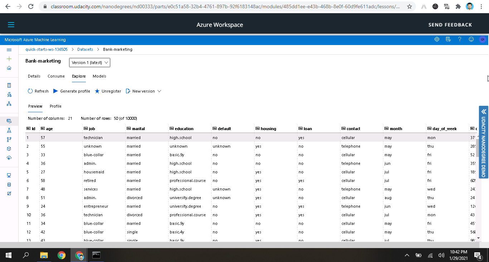
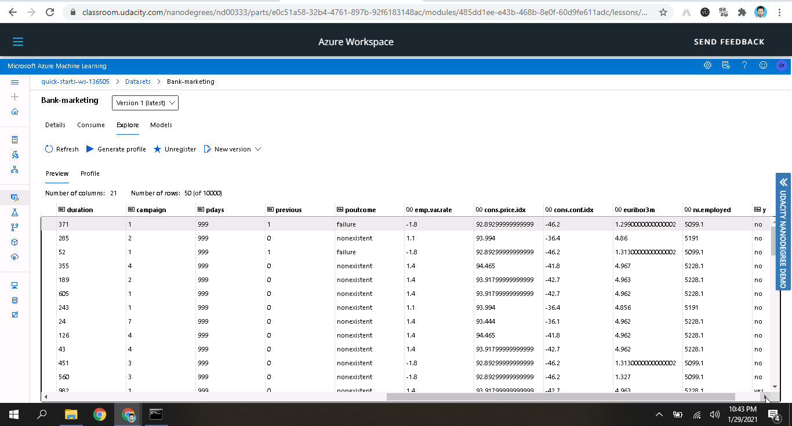
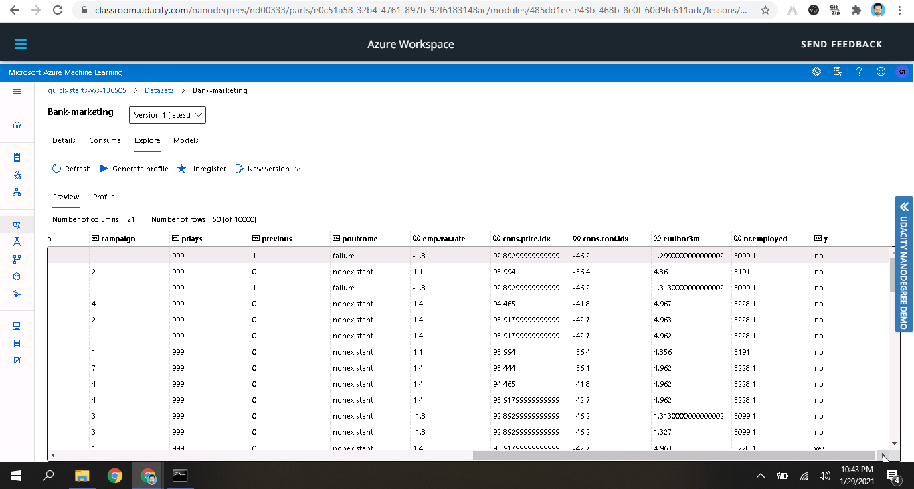
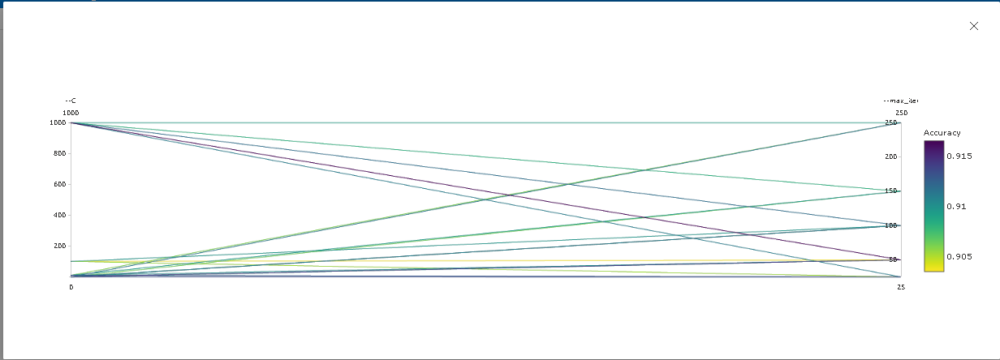
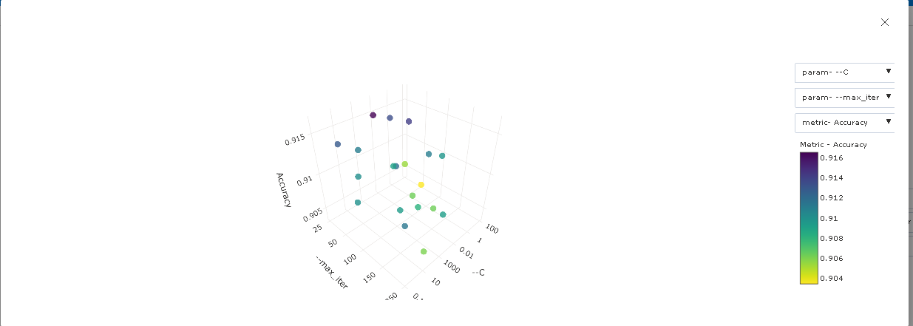
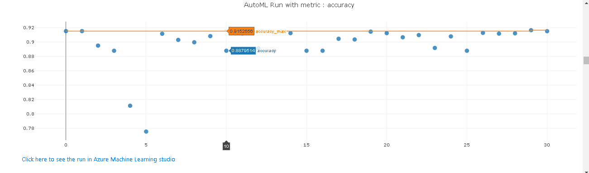
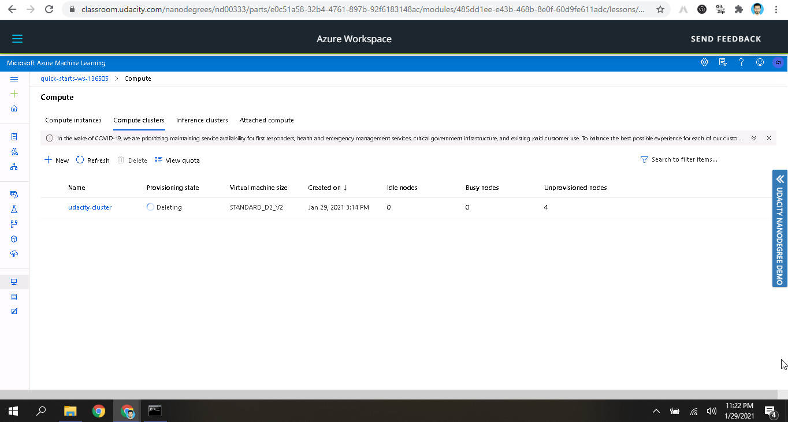

# Optimizing-an-ML-Pipeline-in-Azure

## Overview

This project is part of the Udacity Azure ML Nanodegree. In this project, we build and optimize an Azure ML pipeline using the Python SDK and a provided Scikit-learn model. This model is then compared to an Azure AutoML run.

## Summary
### Problem Statement

### Dataset:

The dataset we have used is the UCI Bank Marketing dataset which is related with direct marketing campaigns of the UCI bank to showcase how we can use HyperDrive and AutoML for a classification problem. The classification goal is to predict if the client will subscribe to a term deposit with the bank denoted by the feature 'y', where 'y' would be subscribed ('yes') or not subscribed ('no'). There are 21 Columns and 10000 rows. 



### Solution

We attempt to solve this problem using Microsoft Azure's Hyperdrive and AutoML, and then compare the performance metrics presented by both. According to our results,both of the models were at par on performance i.e. AutoML based Voting Ensemble model gave an accuracy of 91.65%, versus a Hyperdrive based Logistic Regression model that presented an accuracy metric of 91.65% too.

## Scikit-learn Pipeline

The hyperdrive run involves a series of steps to be completed in order to reach a meaningful result. They are:-
1. Importing the dataset - The desired dataset is located at https://automlsamplenotebookdata.blob.core.windows.net/automl-sample-notebook-data/bankmarketing_train.csv. We create a TabularDataset using TabularDatasetFactory, by utilizing its from_delimited_files() method.
2. Preprocessing - We clean the dataset for use (encoding the features, etc)
3. Splitting the dataset - We split the dataset into train and test sets, where the test size is 0.2.
4. We setup hyperparameter tuning for two parameters - inverse regularization strength 'C' and the maximum number of iterations taken for the solvers to converge 'max_iter' for a Logistic Regression Classifier. The values for C and max_iter were randomly selected from the search spaces [0.01, 0.1, 1, 10, 100, 1000] and [25, 50, 100, 150, 250] respectively.
5. Next, we define a Bandit early termination policy with a slack factor of 0.1 and evaluation_interval of 2.
6. The primary metric to be maximized for this Hyperdrive run is chosen to be 'Accuracy'.
7. The hyperdrive configured experiment is submitted for a run.

As a result of this run, we achieve an accuracy of 91.65% for C = 1 and max_iter = 50.



**What are the benefits of the chosen parameter sampler?**

Random Sampler promotes and supports early termination policies over a range, and allows picking a random value from a given range. This allows for tuning a hyperparameter more efficiently, as the sampler does not go through every single value in the range. Hence, it is possible to train an optimal model in a shorter period of time. Another reason of its selection is that it is faster and supports early termination of low-performance runs. If budget is not an issue, we could use Bayesian Parameter Sampling to explore the hyperparameter space or GridParameterSampling to exhaustively search over the search space.

**What are the benefits of the early stopping policy chosen?**

The Bandit Policy helps in termination of the hyperparameter tuning process, if there occurs a considerable drop in the performance of the model in terms of its chosen primary metric. This helps in eliminating the models that have sub-par performance. Other examples which we can use include Median Stopping Policy and Truncation Selection Policy. The Median Stopping Policy defines an early termination policy based on running averages of the primary metric of all runs while Truncation Selection Policy defines an early termination policy that cancels a given percentage of runs at each evaluation interval. Since Bandit Policy deals primarily with the performance of the model instead of running averages or a specified runs proportion, it terminates runs where the primary metric is not within the specified slack factor/slack amount compared to the best performing run.

## AutoML

Our AutoML experiment and its run trained 48 models. The child-run that gave the best performing model was a Voting Ensemble model with an accuracy of 91.65%. Voting ensemble uses numerous models to make predictions with weighted averages, and then picks the one that has the majority votes.
Here is a XGBoost Classifier part of the voting ensemble, along with its hyperparameters - 
```
28 - xgboostclassifier
{'base_score': 0.5,
 'booster': 'gbtree',
 'colsample_bylevel': 1,
 'colsample_bynode': 1,
 'colsample_bytree': 0.8,
 'eta': 0.01,
 'gamma': 0,
 'learning_rate': 0.1,
 'max_delta_step': 0,
 'max_depth': 4,
 'max_leaves': 3,
 'min_child_weight': 1,
 'missing': nan,
 'n_estimators': 800,
 'n_jobs': 1,
 'nthread': None,
 'objective': 'reg:logistic',
 'random_state': 0,
 'reg_alpha': 0.10416666666666667,
 'reg_lambda': 1.4583333333333335,
 'scale_pos_weight': 1,
 'seed': None,
 'silent': None,
 'subsample': 1,
 'tree_method': 'auto',
 'verbose': -10,
 'verbosity': 0}
 ```
 


## Pipeline Comparison
The hyperdrive pipeline run with a Logistic Regression model gives an accuracy of 91.65% which is equal to the one presented by the VotingEnsemble model of the AutoML run - 91.65%.
There are some differences in the architecture of both the pipelines:
1. Hyperdrive only performs hyperparameter tuning for the chosen model, which in our case is Logistic Regression. On the other hand, AutoML performs hyperparameter tunes all the models it utilizes.
2. Cross validation is performed in the case of AutoML with the value of cross validations = 5, such that each time a randomly sampled fraction (1/5 in our case) of data acts as the test set, and the rest as the train test. However such cross validation is not performed in the case of Hyperdrive pipeline, which only consists of a 20:80 split to estimate the accuracy of each run.

## Future Work
The pipelines were run with the primary metric of Accuracy, which may not be an efficient measure of the performance of a model on an imbalanced dataset. Thus, in the future,  similar runs can be implemented with AUC_Weighted as the primary metric. Other than that, more focus can be put on preprocessing tasks like cleaning the data, removal of outliers, etc. We should also pay attention to the feature importance as explained by the best performing AutoML model.

## Proof of cluster cleanup

